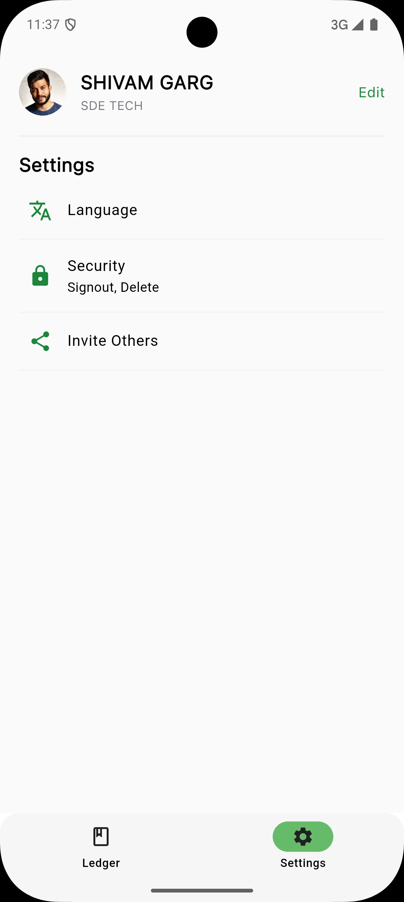

# Credo - AI-Powered Business Ledger App (Frontend)

Credo is a full-stack mobile app built to streamline business operations through intelligent invoice management, client relationship management, and query resolution. The frontend is developed using **Flutter**, and integrates seamlessly with a **Django REST Framework** backend.

---

## ✨ Features

- **AI-Powered Invoice Extraction**  
  Extract invoice data from photos and audio using **Google Gemini API**.

- **Multilingual Support**  
  Available in 8 languages to serve a global user base.

- **Client-Supplier Relationship Management**  
  Manage and track business contacts and interactions.

- **Chat-Based Query Resolution**  
  Communicate and resolve issues using an integrated messaging interface.

- **PDF Invoice Generation & Sharing**  
  Generate, view, and share invoices in PDF format.

- **Real-Time Backend Sync**  
  Data stays updated and in sync via RESTful API calls to the backend.

---

## 📱 Screenshots

### Ledger Page


### Settings Page



### Profile Page


### Language Page


### Add Contact Page


### Transaction Page


### Ledger Detail Page


### Add Receipt Page


### Chats Page


---

## 🛠 Tech Stack

- **Flutter** (3.x or higher)
- **State Management**: `provider`
- **Backend Communication**: `http`
- **PDF & File Handling**: `pdf`, `printing`, `flutter_pdfview`
- **Media Handling**: `image_picker`, `audioplayers`, `just_audio`, `flutter_sound`, `record`
- **Firebase**: `firebase_core`, `firebase_auth`, `firebase_messaging`, `firebase_analytics`, `cloud_firestore`
- **UI Enhancements**: `lottie`, `auto_size_text`, `font_awesome_flutter`, `another_flushbar`
- **Device Features**: `permission_handler`, `local_auth`, `flutter_local_notifications`, `connectivity_plus`, `app_settings`
- **Storage & Settings**: `shared_preferences`, `flutter_dotenv`
- **Internationalization**: `flutter_localizations`, `intl`, `intl_utils`
- **Auth & Security**: `dart_jsonwebtoken`, `googleapis_auth`

---

## 🧰 Setup & Installation

### ✅ Prerequisites

- Flutter SDK (>= 3.0.5 < 4.0.0)
- Android Studio or VS Code with Flutter plugin
- Emulator or physical device

### 🚀 Clone & Run the App

```bash
git clone https://github.com/shivamgarg001/Credo-Frontend.git
cd Credo-Frontend
flutter pub get
flutter run
